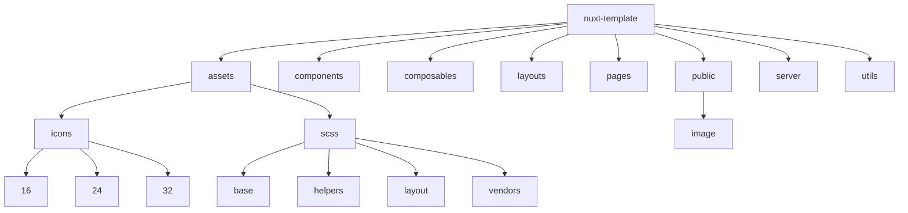

# readme

```mermaid
graph TD;
    nuxt-template-->assets;
    nuxt-template-->components;
    nuxt-template-->composables;
    nuxt-template-->layouts;
    nuxt-template-->pages;
    nuxt-template-->public;
    nuxt-template-->server;
    nuxt-template-->utils;
    assets-->icons;
    assets-->scss;
    scss-->base;
    scss-->helpers;
    scss-->layout;
    scss-->vendors;
    icons-->16;
    icons-->24;
    icons-->32;
    public-->image;
```
